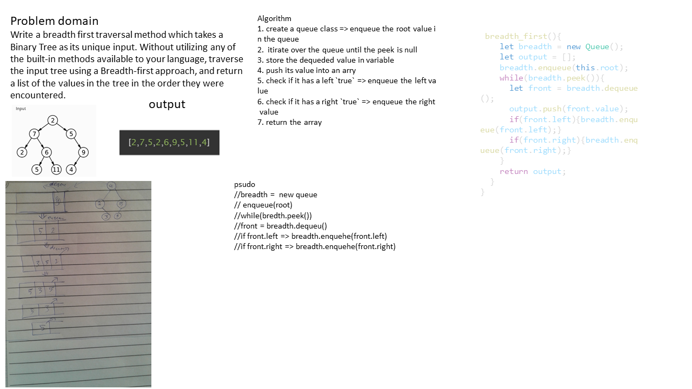

# breadth_first traversal
<!-- Short summary or background information -->
graduate 301 student has a knowlodge in js language
## Challenge
<!-- Description of the challenge -->
Write a breadth first traversal method which takes a Binary Tree as its unique input. Without utilizing any of the built-in methods available to your language, traverse the input tree using a Breadth-first approach, and return a list of the values in the tree in the order they were encountered.
## Approach & Efficiency
<!-- What approach did you take? Why? What is the Big O space/time for this approach? -->
1. create a queue class => enqueue the root value in the queue
2.  itirate over the queue until the peek is null
3. store the dequeded value in variable
4. push its value into an arry
5. check if it has a left `true` => enqueue the left value
6. check if it has a right `true` => enqueue the right value
7. return the array
### the Big O is Big O Of(n)
#### `breadth_first()`
- time: Big O Of(n)
- space: Big O Of(n)

board image -->

