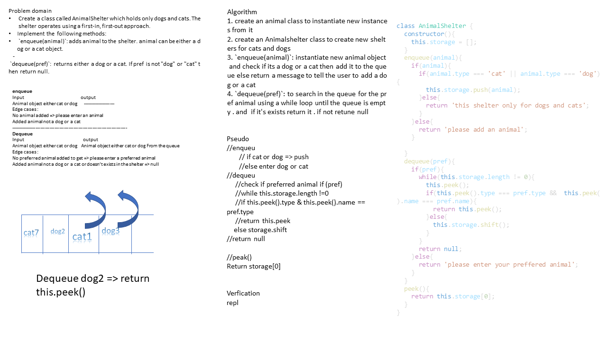

# Animal shelter
<!-- Short summary or background information -->
graduate 301 student has a knowlodge in js language
## Challenge
<!-- Description of the challenge -->
- Create a class called AnimalShelter which holds only dogs and cats. The shelter operates using a first-in, first-out approach.
- Implement the following methods:
   - `enqueue(animal)`: adds animal to the shelter. animal can be either a dog or a cat object.
   - `dequeue(pref)`: returns either a dog or a cat. If pref is not "dog" or "cat" then return null.
## Approach & Efficiency
<!-- What approach did you take? Why? What is the Big O space/time for this approach? -->
1. create an animal class to instantiate new instances from it 
2.  create an Animalshelter class to create new shelters for cats and dogs
3. `enqueue(animal)` : instantiate new animal object and check if its a dog or a cat then add it to the queue else return a message to tell the user to add a dog or a cat
4. `dequeue(pref)`: to search in the queue for the pref animal using a while loop until the queue is empty . and  if it's exists return it . if not retune null

### the Big O is Big O Of(n)
#### `enqueue(animal)`
- time: Big O Of(1)
- space: Big O Of(1)
#### `dequeue(animal)`
- time: Big O Of(n)
- space: Big O Of(1)

board image -->

