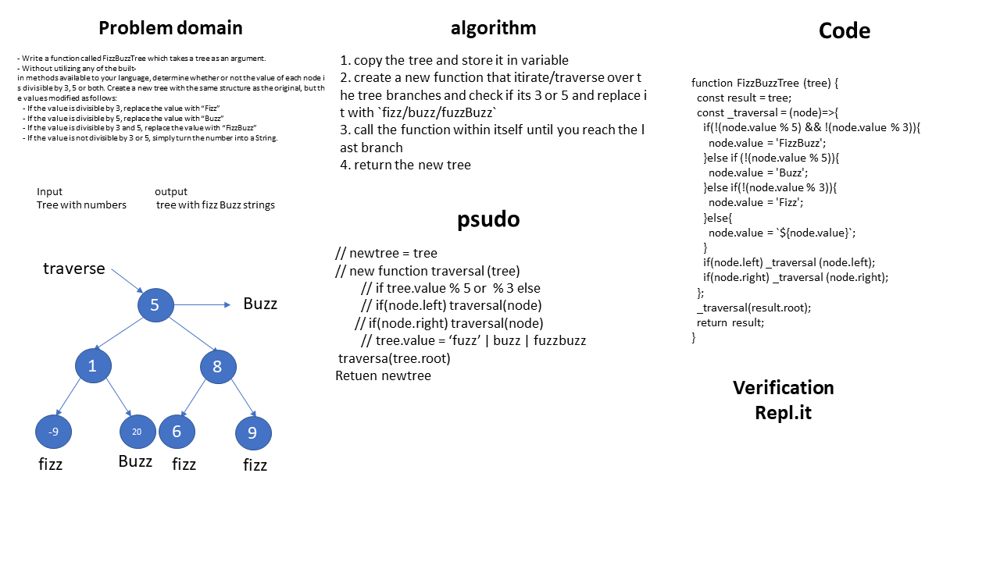

# FizzBuzzTree
<!-- Short summary or background information -->
graduate 301 student has a knowlodge in js language
## Challenge
<!-- Description of the challenge -->
- Write a function called FizzBuzzTree which takes a tree as an argument.
- Without utilizing any of the built-in methods available to your language, determine whether or not the value of each node is divisible by 3, 5 or both. Create a new tree with the same structure as the original, but the values modified as follows:
   - If the value is divisible by 3, replace the value with “Fizz”
   - If the value is divisible by 5, replace the value with “Buzz”
   - If the value is divisible by 3 and 5, replace the value with “FizzBuzz”
   - If the value is not divisible by 3 or 5, simply turn the number into a String.
## Approach & Efficiency
<!-- What approach did you take? Why? What is the Big O space/time for this approach? -->
1. copy the tree and store it in variable
2. create a new function that itirate/traverse over the tree branches and check if its 3 or 5 and replace it with `fizz/buzz/fuzzBuzz` 
3. call the function within itself until you reach the last branch 
4. return the new tree

### the Big O is Big O Of(n)
#### `FizzBuzzTree(tree)`
- time: Big O Of(2)
- space: Big O Of(1)

board image -->

