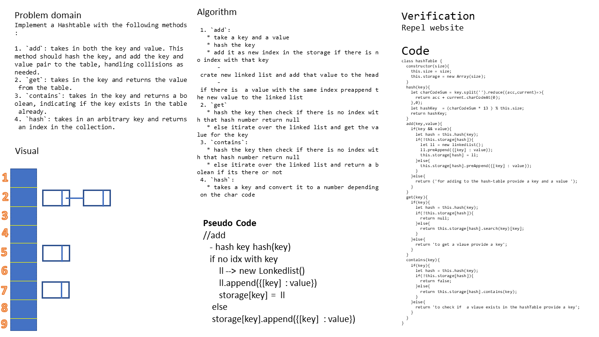

# Hash Table
<!-- Short summary or background information -->
graduate 301 student has a knowlodge in js language
## Challenge
<!-- Description of the challenge -->
Implement a Hashtable with the following methods:

1. `add`: takes in both the key and value. This method should hash the key, and add the key and value pair to the table, handling collisions as needed.
2. `get`: takes in the key and returns the value from the table.
3. `contains`: takes in the key and returns a boolean, indicating if the key exists in the table already.
4. `hash`: takes in an arbitrary key and returns an index in the collection.
<!-- What approach did you take? Why? What is the Big O space/time for this approach? -->
 1. `add`:
   * take a key and a value 
   * hash the key
   * add it as new index in the storage if there is no index with that key
      - crate new linked list and add that value to the head
      - if there is  a value with the same index preappend the new value to the linked list
 2. `get`
   * hash the key then check if there is no index with that hash number return null
   * else itirate over the linked list and get the value for the key
 3. `contains`:
   * hash the key then check if there is no index with that hash number return null
   * else itirate over the linked list and return a bolean if its there or not
 4. `hash`:
   * takes a key and convert it to a number depending on the char code

### the Big O is Big O Of(n)
#### `add(key,value)`
- time: Big O Of(1)
- space: Big O Of(1)
#### `get(key)`
- time: Big O Of(n)
- space: Big O Of(1)
#### `contains(key)`
- time: Big O Of(n)
- space: Big O Of(1)
#### `hash(key)`
- time: Big O Of(1)
- space: Big O Of(1)

## Solution
<!-- Embedded whiteboard image -->

