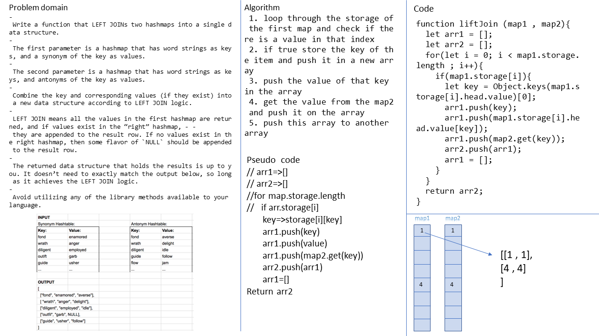

# lift join
<!-- Short summary or background information -->
graduate 301 student has a knowlodge in js language
## Challenge
<!-- Description of the challenge -->
- Write a function that LEFT JOINs two hashmaps into a single data structure.
- The first parameter is a hashmap that has word strings as keys, and a synonym of the key as values.
- The second parameter is a hashmap that has word strings as keys, and antonyms of the key as values.
- Combine the key and corresponding values (if they exist) into a new data structure according to LEFT JOIN logic.
- LEFT JOIN means all the values in the first hashmap are returned, and if values exist in the “right” hashmap, - - they are appended to the result row. If no values exist in the right hashmap, then some flavor of `NULL` should be appended to the result row.
- The returned data structure that holds the results is up to you. It doesn’t need to exactly match the output below, so long as it achieves the LEFT JOIN logic.
- Avoid utilizing any of the library methods available to your language.
<!-- What approach did you take? Why? What is the Big O space/time for this approach? -->
 1. loop through the storage of the first map and check if there is a value in that index
 2. if true store the key of the item and push it in a new array 
 3. push the value of that key in the array
 4. get the value from the map2 and push it on the array 
 5. push this array to another array

### the Big O is Big O Of(n)
#### `liftJoin(map1,map2)`
- time: Big O Of(n)
- space: Big O Of(n)

## Solution
<!-- Embedded whiteboard image -->

