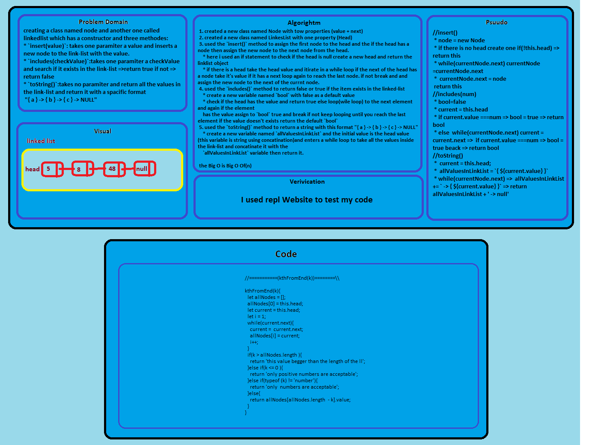

# Linked list
<!-- Short summary or background information -->
graduate 301 student has a knowlodge in js language
## Challenge
<!-- Description of the challenge -->
creating a class named node and another one called linkedlist which has a constructor and three methodes:
* `insert(value)`: takes one paramiter a value and inserts a new node to the link-list with the value.
* `includes(checkValue)`:takes one paramiter a checkValue and search if it exists in the link-list =>return true if not =>return false
* `toString()`:takes no paramiter and return all the values in the link-list and return it with a spacific format
 "{ a } -> { b } -> { c } -> NULL"
## Approach & Efficiency
<!-- What approach did you take? Why? What is the Big O space/time for this approach? -->
 1. created a new class named Node with tow properties (value + next)
 2. created a new class named LinkesList with one property (Head)
 3. used the `insert()` method to assign the first node to the head and the if the head has a node then assign the new node to the next node from the head.
    * here i used an if statement to check if the head is null create a new head and return the linklist object
    * if there is a head take the head value and itirate in a while loop if the next of the head has a node take it's value if it has a next loop again to reach the last node. if not break and and assign the new node to the next of the currnt node.
 4. used the `includes()` method to return false or true if the item exists in the linked-list
    * create a new variable named `bool` with false as a default value
    * check if the head has the value and return true else loop(wile loop) to the next element and again if the element 
    has the value assign to `bool` true and break if not keep looping until you reach the last element if the value doesn't exists return the default `bool`
 5. used the `toString()` method to return a string with this format "{ a } -> { b } -> { c } -> NULL"
    * create a new variable named `allValuesInLinkList` and the initial value is the head value (this variable is string using concatination)and enters a while loop to take all the values inside the link-list and concatinate it with the 
    `allValuesInLinkList` variable then return it.
6. used the `kthFromEnd()` method to return kth node value in the ll.

### the Big O is Big O Of(n)
#### `insert(value)`
- time: Big O Of(1)
- space: Big O Of(1)
#### `append(value)`
- time: Big O Of(n)
- space: Big O Of(1)
#### `insertBefore(value,newValue)`
- time: Big O Of(n)
- space: Big O Of(1)
#### `insertAfter(value,newValue)`
- time: Big O Of(n)
- space: Big O Of(1)
#### `includes(value)`
- time: Big O Of(n)
- space: Big O Of(1)
#### `toString()`
- time: Big O Of(n)
- space: Big O Of(1)
#### `kthFromEnd()`
- time: Big O Of(n)
- space: Big O Of(n)
## Solution
<!-- Embedded whiteboard image -->

