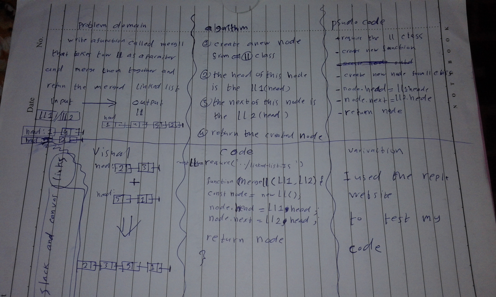

# Linked list
<!-- Short summary or background information -->
graduate 301 student has a knowlodge in js language
## Challenge
<!-- Description of the challenge -->
create a function named mergeLists that takes to Linked-lists and merge the into one Linked-lists
## Approach & Efficiency
<!-- What approach did you take? Why? What is the Big O space/time for this approach? -->
i created new node inside the function and the head of the node is the head of the ll1 head then i looped to the last node and add the ll2 head  at the last of the node

### the Big O is Big O Of(n)

#### `mergeLists()`
- time: Big O Of(n)
- space: Big O Of(1)
## Solution
<!-- Embedded whiteboard image -->

