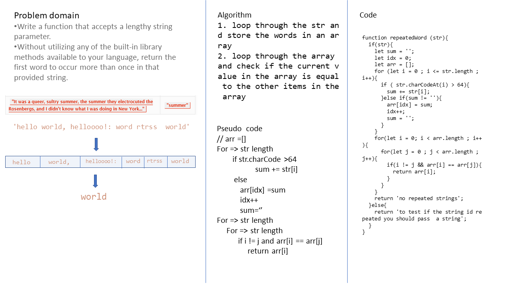

# Linked list
<!-- Short summary or background information -->
graduate 301 student has a knowlodge in js language
## Challenge
<!-- Description of the challenge -->
- Write a function that accepts a lengthy string parameter.
- Without utilizing any of the built-in library methods available to your language, return the first word to occur more than once in that provided string.
## Approach & Efficiency
<!-- What approach did you take? Why? What is the Big O space/time for this approach? -->
1. loop through the str and store the words in an array
2. loop through the array and check if the current value in the array is equal to the other items in the array 
### the Big O is Big O Of(n)

- time: Big O Of(n2)
- space: Big O Of(n)

## Solution
<!-- Embedded whiteboard image -->

