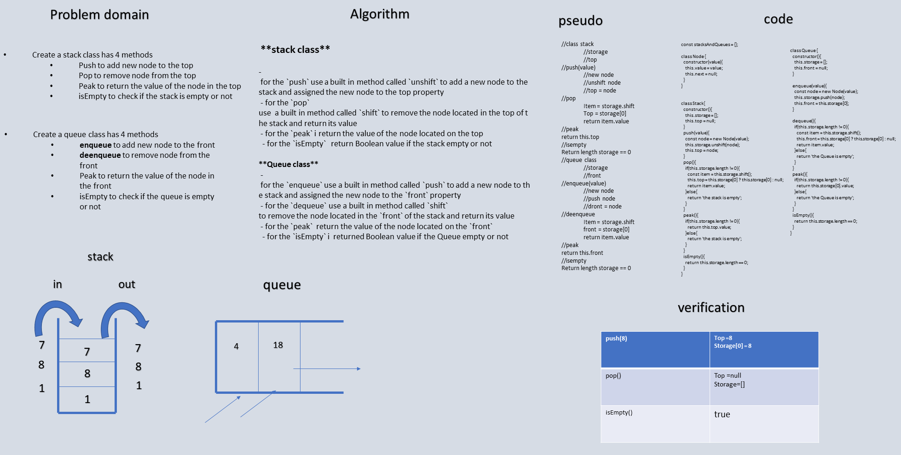

# stack and Queue
<!-- Short summary or background information -->
graduate 301 student has a knowlodge in js language
## Challenge
<!-- Description of the challenge -->
* Create a `Node` class that has properties for the value stored in the Node, and a pointer to the next node.
* Create a Stack `class` that has a `top` property. It creates an empty Stack when instantiated.
    - This object should be aware of a default empty value assigned to `top` when the stack is created.
    - Define a method called `push` which takes any value as an argument and adds a new node with that value to the top of the stack with an O(1) Time performance.
    - Define a method called `pop` that does not take any argument, removes the node from the top of the stack, and returns the node’s value.
        - Should raise exception when called on empty stack
    - Define a method called `peek` that does not take an argument and returns the value of the node located on top of the stack, without removing it from the stack
        - Should raise exception when called on empty stack
    - Define a method called `isEmpty` that takes no argument, and returns a boolean indicating whether or not the stack is empty.
* Create a `Queue` class that has a `front` property. It creates an empty Queue when instantiated.
    - This object should be aware of a default empty value assigned to `front` when the queue is created.
    - Define a method called `enqueue` which takes any value as an argument and adds a new node with that value to the back of the queue with an O(1) Time performance.
    - Define a method called `dequeue` that does not take any argument, removes the node from the front of the queue, and returns the node’s value.
        - Should raise exception when called on empty queue
    - Define a method called `peek` that does not take an argument and returns the value of the node located in the front of the queue, without removing it from the queue.
        - Should raise exception when called on empty queue
    - Define a method called `isEmpty` that takes no argument, and returns a boolean indicating whether or not the queue is empty.
## Approach & Efficiency
<!-- What approach did you take? Why? What is the Big O space/time for this approach? -->
**stack class**
 - for the `push` i used a built in methode called `unshift` to add a new node to the stack and assigned the new node to the top property
 - for the `pop` i used a built in methode called `shift` to remove the node located in the top of the stack and return its value
 - for the `peak` i  returned the value of the node located on the top
  - for the `isEmpty` i  returned bolean value if the stack empty or not
**Queue class**
 - for the `enqueue` i used a built in methode called `push` to add a new node to the stack and assigned the new node to the `front` property
 - for the `dequeue` i used a built in methode called `shift`to remove the node located in the `front` of the stack and return its value
 - for the `peak` i  returned the value of the node located on the `front`
  - for the `isEmpty` i  returned bolean value if the Queue empty or not
### the Big O is Big O Of(n)
### Stack
#### `push()`
- time: Big O Of(1)
- space: Big O Of(1)
#### `pop()`
- time: Big O Of(1)
- space: Big O Of(1)
#### `peek()`
- time: Big O Of(1)
- space: Big O Of(1)
#### `isEmpty()`
- time: Big O Of(1)
- space: Big O Of(1)
### Queue
#### `enqueue()`
- time: Big O Of(1)
- space: Big O Of(1)
#### `dequeue()`
- time: Big O Of(1)
- space: Big O Of(1)
#### `peek()`
- time: Big O Of(1)
- space: Big O Of(1)
#### `isEmpty()`
- time: Big O Of(1)
- space: Big O Of(1)
## Solution
<!-- Embedded whiteboard image -->

