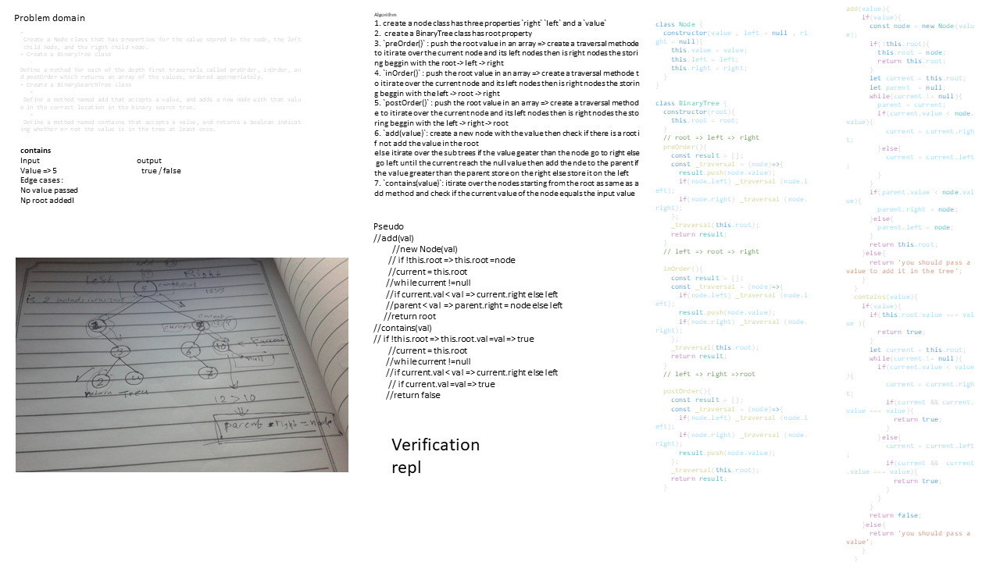
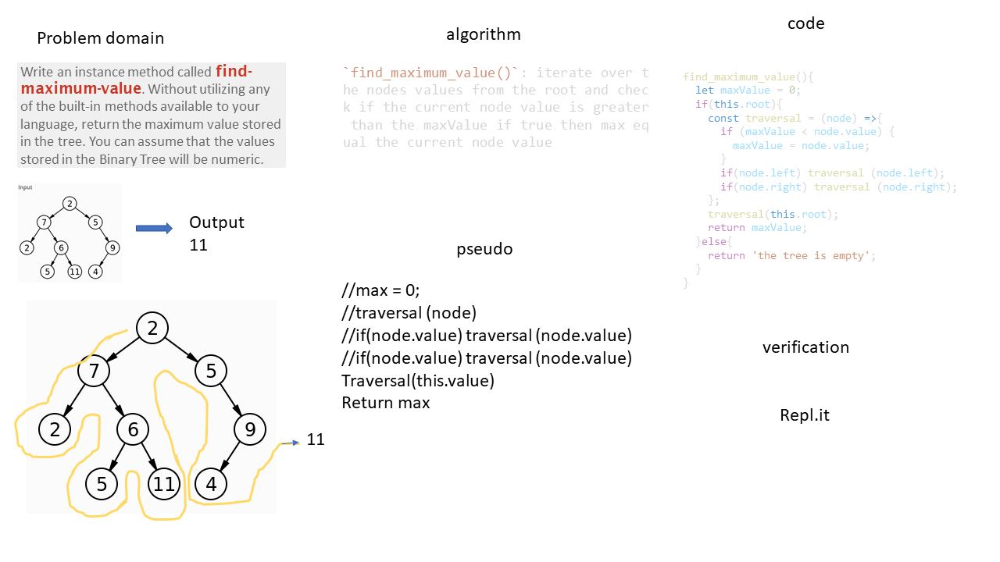

# trees
<!-- Short summary or background information -->
graduate 301 student has a knowlodge in js language
## Challenge
<!-- Description of the challenge -->
- Create a Node class that has properties for the value stored in the node, the left child node, and the right child node.
- Create a BinaryTree class
   -Define a method for each of the depth first traversals called preOrder, inOrder, and postOrder which returns an array of the values, ordered appropriately.
- Create a BinarySearchTree class
   - Define a method named add that accepts a value, and adds a new node with that value in the correct location in the binary search tree.
   - Define a method named contains that accepts a value, and returns a boolean indicating whether or not the value is in the tree at least once.
## Approach & Efficiency
<!-- What approach did you take? Why? What is the Big O space/time for this approach? -->
1. create a node class has three properties `right` `left` and a `value`
2.  create a BinaryTree class has root property
3. `preOrder()` : push the root value in an array => create a traversal methode to itirate over the current node and its left nodes then is right nodes the storing beggin with the root -> left -> right 
4. `inOrder()` : push the root value in an array => create a traversal methode to itirate over the current node and its left nodes then is right nodes the storing beggin with the left -> root -> right 
5. `postOrder()` : push the root value in an array => create a traversal methode to itirate over the current node and its left nodes then is right nodes the storing beggin with the left -> right -> root 
6. `add(value)`: create a new node with the value then check if there is a root if not add the value in the root
else itirate over the sub trees if the value geater than the node go to right else go left until the current reach the null value then add the nde to the parent if the value greater than the parent store on the right else store it on the left 
7. `contains(value)`: itirate over the nodes starting from the root as same as add method and check if the current value of the node equals the input value
8. `find_maximum_value()`: itirate over the nodes values from the root and check if the current node value is greater than the maxValue if true then max equal the current node value 
### the Big O is Big O Of(n)
#### `preOrder()`
- time: Big O Of(n)
- space: Big O Of(n)
#### `inOrder()`
- time: Big O Of(n)
- space: Big O Of(n)
#### `postOrder()`
- time: Big O Of(n)
- space: Big O Of(n)
#### `add()`
- time: Big O Of(n)
- space: Big O Of(1)
#### `preOrder()`
- time: Big O Of(n)
- space: Big O Of(1)
#### `find_maximum_value()`
- time: Big O Of(n)
- space: Big O Of(1)

find_maximum_value
board image -->

