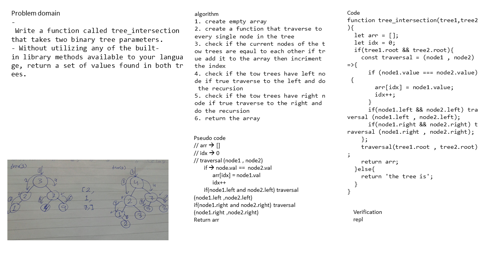

# tree_intersection
<!-- Short summary or background information -->
graduate 301 student has a knowlodge in js language
## Challenge
<!-- Description of the challenge -->
- Write a function called tree_intersection that takes two binary tree parameters.
- Without utilizing any of the built-in library methods available to your language, return a set of values found in both trees.
## Approach & Efficiency
<!-- What approach did you take? Why? What is the Big O space/time for this approach? -->
1. create empty array
2. create a function that traverse to every single node in the tree 
3. check if the current nodes of the tow trees are eqaul to each other if true add it to the array then incriment the index
4. check if the tow trees have left node if true traverse to the left and do the recursion
5. check if the tow trees have right node if true traverse to the right and do the recursion
6. return the array
### the Big O is Big O Of(n)
#### `tree_intersection()`
- time: Big O Of(n)
- space: Big O Of(n)

