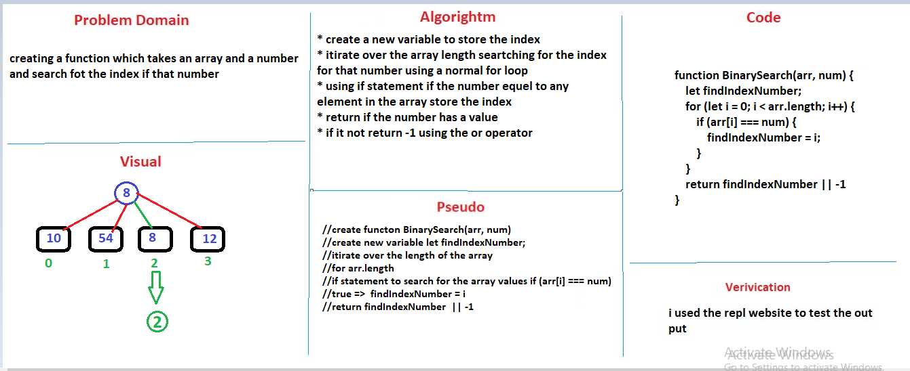

# Reverse an Array
<!-- Short summary or background information -->
graduate 301 student has a knowlodge in js language
## Challenge
<!-- Description of the challenge -->
creating a function which takes an array and a number and search fot the index if that number
## Approach & Efficiency
<!-- What approach did you take? Why? What is the Big O space/time for this approach? -->
will, i declared a new number to store the index inside it
 i used the normal for loop to assign the index value  to the number but if it exist in the array if it is not return -1

## Solution
<!-- Embedded whiteboard image -->

