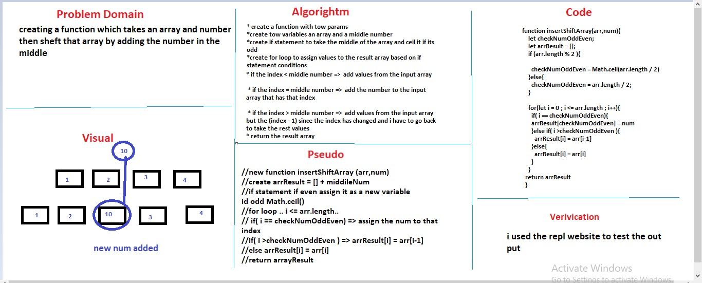

# Reverse an Array
<!-- Short summary or background information -->
graduate 301 student has a knowlodge in js language
## Challenge
<!-- Description of the challenge -->
creating a function which takes an array and number then sheft that array by adding the number in the middle   
## Approach & Efficiency
<!-- What approach did you take? Why? What is the Big O space/time for this approach? -->
will, i declared a new array with name arrResult and a number to take the middle of the array and ceil it if its an odd num then 
 i used the normal for loop to assign new values to the arrResult and when i reach the middle a assigned the number to it , after that i continued assigning the rest of the values using an IF statement.
 i build my logic based on IF statement 

 * if the index < middle number =>  add values from the input array

 * if the index = middle number =>  add the number to the input array that has that index

 * if the index > middle number =>  add values from the input array but the (index - 1) since the index has changed and i have to go back to take the rest values

## Solution
<!-- Embedded whiteboard image -->

