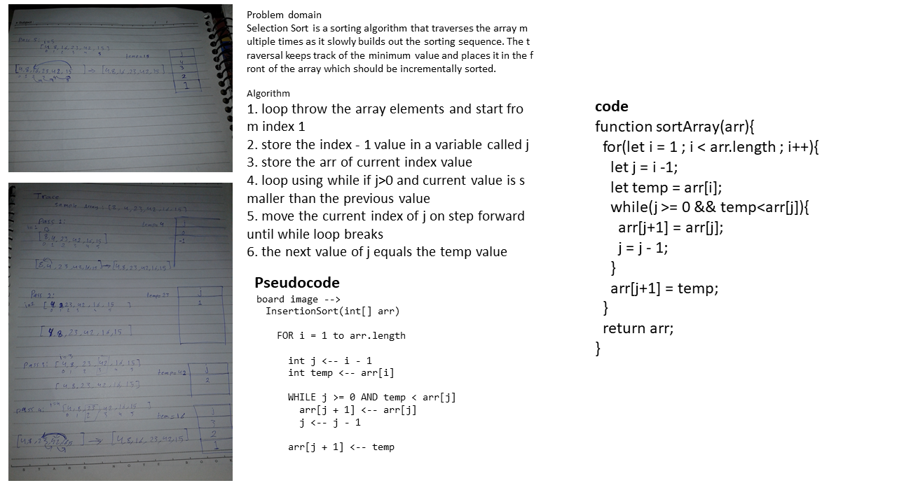

# Selection Sort

<!-- Short summary or background information -->
graduate 301 student has a knowlodge in js language
## Challenge
<!-- Description of the challenge -->

## Approach & Efficiency
<!-- What approach did you take? Why? What is the Big O space/time for this approach? -->

### the Big O is Big O Of(n)
#### `breadth_first()`
- time: Big O Of(n)
- space: Big O Of(2)

<!--  -->

