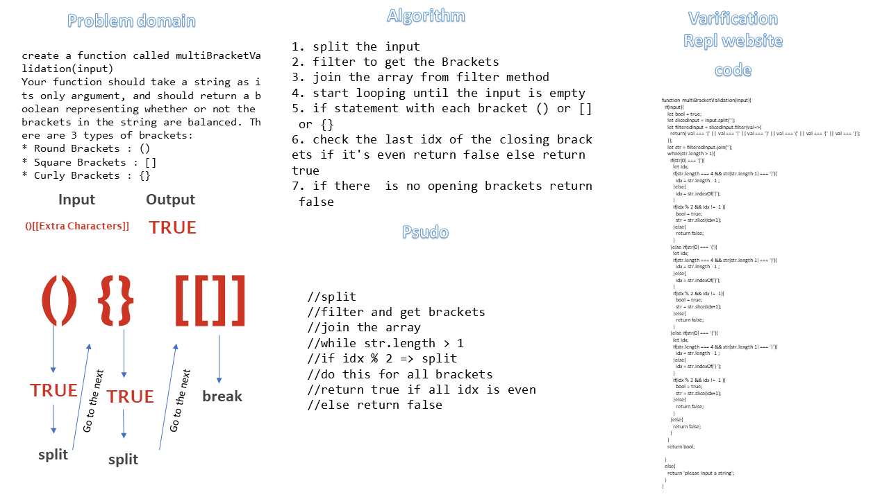

# Reverse an Array
<!-- Short summary or background information -->

graduate 301 student has a knowlodge in js language

## Challenge

<!-- Description of the challenge -->

create a function called multiBracketValidation(input)
Your function should take a string as its only argument, and should return a boolean representing whether or not the brackets in the string are balanced. There are 3 types of brackets:

* Round Brackets : ()
* Square Brackets : []
* Curly Brackets : {}

## Approach & Efficiency

<!-- What approach did you take? Why? What is the Big O space/time for this approach? -->

1. split the input
2. filter to get the Brackets
3. join the array from filter method
4. start looping untill the input is empty
5. if statement with each bracket () or [] or {}
6. check the last idx of the closing brackets if it's even return false else return true
7. if there  is no oppening brackets return false

#### `multiBracketValidation(input)`
- time: Big O Of(n2)
- space: Big O Of(n)

## Solution
<!-- Embedded whiteboard image -->

