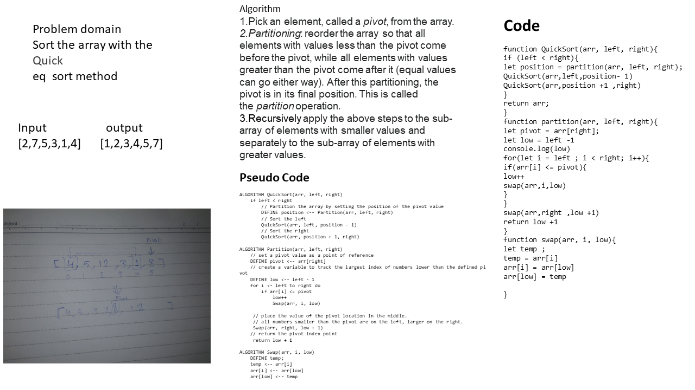

# Selection Sort

<!-- Short summary or background information -->
graduate 301 student has a knowlodge in js language
## Challenge
<!-- Description of the challenge -->
Sort the array with the Quick
eq  sort method

## Approach & Efficiency
<!-- What approach did you take? Why? What is the Big O space/time for this approach? -->
- Pick an element, called a pivot, from the array.
- Partitioning: reorder the array so that all elements with values less than the pivot come before the pivot, while all elements with values greater than the pivot come after it (equal values can go either way). After this partitioning, the pivot is in its final position. This is called the partition operation.
- Recursively apply the above steps to the sub-array of elements with smaller values and separately to the sub-array of elements with greater values.

### the Big O is Big O Of(n)
#### `breadth_first()`
- time: Big O Of(nlog2)
- space: Big O Of(2)

